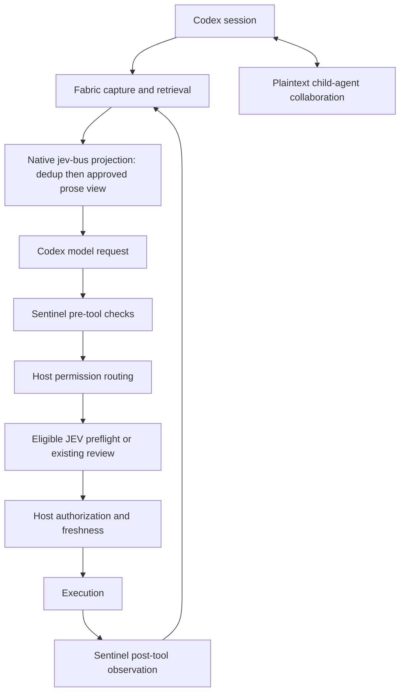

# JEV integration architecture

## Lifecycle

## Boundaries

| Boundary | Owner | Notes |
| --- | --- | --- |
| `jev_bus` stage ordering and single invocation | `jev-prune-kit` contract, hosted by the native adapter in this repository | Stage 100 is duplicate-read dedup; stage 200 is the approved Fabric view. |
| Event envelope and correlation identifiers | this repository | Other components emit envelopes; only the host defines the schema. |
| Memory tools and retrieval | `jev-context-fabric` | Capture happens before projection; retrieval is budgeted and source-backed. |
| Boundary observation and vetoes | `jev-sentinel` | Shadow first; enforcement only where a veto is representable. |
| Approval preflight | `jev-codex-approval` | Eligible review attempts only; failure or uncertainty defers to the existing reviewer. |
| Authorization, sandbox, cancellation, compaction, final execution | this repository (host) | Never delegated to a component. |

## Exclusions

OmniRoute is excluded from the integrated stack. It is not a manifest component,
it is listed under `integration.excluded_repositories`, and the validator
fails closed if it appears as a component. No routing, gateway, or deployment
asset from that repository is part of this architecture.

## Components that change host behavior

Only two kinds of integration change this repository's source:

1. **Ordered patches** recorded in `compatibility-manifest.json` under `patches`,
   each pinned by digest and by the host base commit it applies to.
2. **Native adapters** written in this repository behind a feature switch whose
   default is declared in the manifest.

Everything else stays in the owning component repository and is consumed through
an interface with a declared version.

## Plaintext collaboration

Child-agent messages are plaintext in this build. Two patches implement it, and
they stay in separate layers so the component patch keeps its upstream identity:

| Patch | Owner | Content |
| --- | --- | --- |
| `0001-plaintext-collab` | `codex-plaintext-collab` | Removes the `encrypted` marker from the collaboration `message` parameter of `spawn_agent`, `send_message`, and `followup_task`, and relaxes the router so a collaboration call with absent *or* empty `encrypted_function_args` is classified as `DirectPlaintextMessage`. |
| `0002-plaintext-host-test-alignment` | this repository | Updates the host tests that asserted the removed markers and the old classification, so the pinned build's own suite still passes. |

Two decision points stay host-owned, and they are the only places the transport
is chosen:

| Decision | Site | This build |
| --- | --- | --- |
| Ask the backend to encrypt | collaboration tool schema `encrypted` marker | never set for these three parameters |
| Treat a returned call as plaintext | `ToolCall::direct_source()` | absent or empty `encrypted_function_args` |

Preserved behavior:

- An explicit catalog override that declares
  `parameters.properties.message.encrypted = true` is still honored; the harness
  re-applies the marker only for parameters the built-in spec marks encrypted.
- A returned call that *does* carry encrypted arguments keeps the encrypted
  transport, so the encrypted path stays tested.
- Existing ciphertext records stay opaque. Nothing is decrypted: the key is
  server-side, so already-stored `gAAAAA...` messages are forwarded verbatim and
  remain unreadable.

Disable: build the pinned base without patches
(`jev/scripts/build-pinned-codex.sh --no-patches`) and run the baseline profile.
Removing the patch layer restores the upstream markers and expectations instead
of approximating them.

## Evidence tiers

Every validation claim is labelled with the tier that produced it:

| Tier | Meaning |
| --- | --- |
| offline fixture | Deterministic local tests with injected inputs and no model calls. |
| real host, mocked service | The real Codex host code path with the Responses API mocked; this proves host wiring, not model safety. |
| live provider | A real model call. This requires explicit configuration, a positive budget, and operator consent; it is never implicit. |

Fixture results are never presented as evidence of live model accuracy, safety,
or performance.
