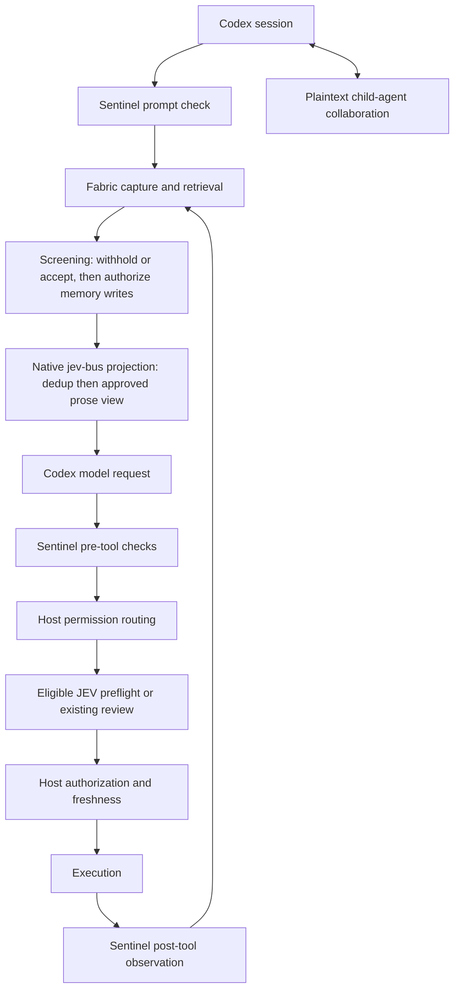

# JEV integration architecture

## Lifecycle

## Boundaries

| Boundary | Owner | Notes |
| --- | --- | --- |
| `jev_bus` stage ordering and single invocation | `jev-prune-kit` contract, hosted by the native adapter in this repository | Stage 100 is duplicate-read dedup; stage 200 is the approved Fabric view. |
| Event envelope and correlation identifiers | this repository | Other components emit envelopes; only the host defines the schema. |
| Memory tools and retrieval | `jev-context-fabric` | Capture happens before projection; retrieval is budgeted and source-backed. |
| Boundary observation and vetoes | `jev-sentinel` | Prompt, pre-tool, and post-tool; shadow first; enforcement only where a veto is representable. Host carriers in [`SENTINEL_BOUNDARY.md`](SENTINEL_BOUNDARY.md) and [`VETO_PRECEDENCE.md`](VETO_PRECEDENCE.md). |
| Veto precedence, the session latch, and concurrent-action handling | this repository (host) | The host orders the finding's severity against the session latch, never downgrades a veto, serializes one session's evaluations, and fails closed. The component still owns detection. |
| Retrieval screening before injection, and memory-write authorization | this repository (host) | The host withholds what it can prove itself (origin, workspace, redaction, budget, the session veto, an unauthorized write target) and records what it cannot; the component stays the only detection oracle. See [`RETRIEVAL_SCREENING.md`](RETRIEVAL_SCREENING.md). |
| Incident operations over the host journal | this repository (host) | Bounded, metadata-only, read-only, and correlated to canonical evidence; the disable plan is printed and never executed. See [`INCIDENT_OPERATIONS.md`](INCIDENT_OPERATIONS.md). |
| Approval preflight | `jev-codex-approval` | Eligible review attempts only; failure or uncertainty defers to the existing reviewer. |
| Authorization, sandbox, cancellation, compaction, final execution | this repository (host) | Never delegated to a component. |

## Exclusions

OmniRoute is excluded from the integrated stack. It is not a manifest component,
it is listed under `integration.excluded_repositories`, and the validator
fails closed if it appears as a component. No routing, gateway, or deployment
asset from that repository is part of this architecture.

## Components that change host behavior

Only two kinds of integration change this repository's source:

1. **Ordered patches** recorded in `compatibility-manifest.json` under `patches`,
   each pinned by digest and by the host base commit it applies to.
2. **Native adapters** written in this repository behind a feature switch whose
   default is declared in the manifest.

Everything else stays in the owning component repository and is consumed through
an interface with a declared version.

Each native adapter is declared in the manifest under the component that owns it
(`native_source_adapter`), so the installed file, the declarations it creates,
and the host blobs it was applied to are all checkable:

| Adapter | Component | Installed at | Switch (default) | Recorded in |
| --- | --- | --- | --- | --- |
| Approval preflight and Guardian fallback | `jev-codex-approval` | `codex-rs/core/src/guardian/jev.rs` | `approval.preflight` (false) | [`APPROVAL_PREFLIGHT.md`](APPROVAL_PREFLIGHT.md) |

## Evidence tiers

Every validation claim is labelled with the tier that produced it:

| Tier | Meaning |
| --- | --- |
| offline fixture | Deterministic local tests with injected inputs and no model calls. |
| real host, mocked service | The real Codex host code path with the Responses API mocked; this proves host wiring, not model safety. |
| live provider | A real model call. This requires explicit configuration, a positive budget, and operator consent; it is never implicit. |

Fixture results are never presented as evidence of live model accuracy, safety,
or performance.
