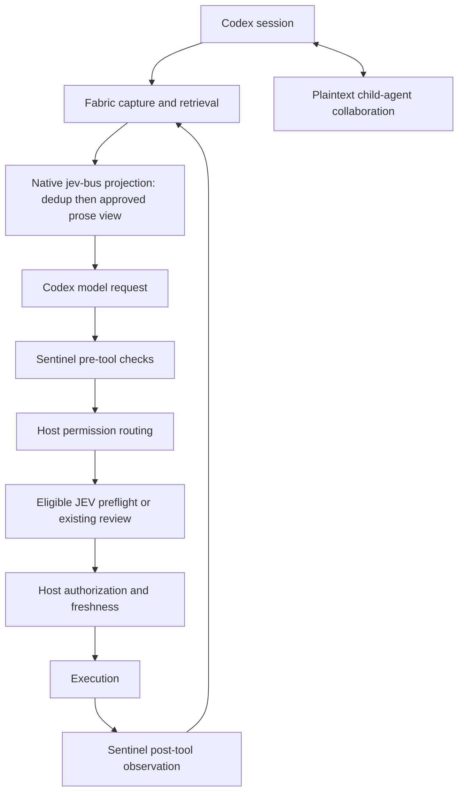

# Integrated architecture

The integration host is this fork. Every other component keeps its own repository,
its own release process, and its own files; the host pins exact revisions and owns
the single boundary where outgoing model requests may be transformed.

## Boundaries

| Boundary | Owner | Contract |
| --- | --- | --- |
| Canonical capture | `jev-context-fabric` | Evidence is captured before any projection; the stored bytes and their SHA-256 are authoritative. |
| Outgoing transform | this fork (`codex-jev`) | Exactly one native adapter owns the jev-bus boundary. Stages run in priority order inside it. |
| Duplicate-read stage | `jev-prune-kit` | Priority 100. Substitutes duplicate read bodies in place without changing the message count. |
| Approved prose view | `jev-context-fabric` | Priority 200. Consumes the post-dedup snapshot and only removes prose a local approval already accepted. |
| Boundary observation and veto | `jev-sentinel` | Observes prompt, pre-tool, and post-tool events. A veto cannot be cleared by a later approval. |
| Eligible review preflight | `jev-codex-approval` | Runs only inside eligible synchronous review attempts; failure or uncertainty defers to the existing reviewer inside the original deadline. |
| Permissions, sandbox, cancellation, review requirement, execution | this fork (`codex-jev`) | No component grants, widens, or bypasses host authority. |

## Invariants

1. Capture canonical evidence before context projection.
2. Preserve original transcripts; prune only the outgoing view.
3. One native adapter owns the jev-bus transformation boundary.
4. Duplicate-read pruning (priority 100) runs before the approved prose view (priority 200).
5. Recalled content and collaboration messages are evidence, never authorization.
6. A Sentinel veto cannot be cleared by a later approval.
7. Approval preflight applies only to eligible review attempts.
8. Host permissions, sandbox enforcement, mandatory review, cancellation, freshness checks, and final execution ownership are preserved.
9. A projection failure preserves the appropriate stage input.
10. Approval failure or uncertainty defers to the existing reviewer within the original deadline.
11. Native compaction stays functional, and byte counts are never reported as measured tokens.
12. Optional remote inference stays disabled unless it is separately authorized and budgeted.

## Excluded

`omniroute-codex-docker` is excluded from this integration. The manifest records it
under `excluded`, and `verify_manifest.py` refuses a request that selects it, so an
excluded component cannot be pulled back in by configuration drift.
